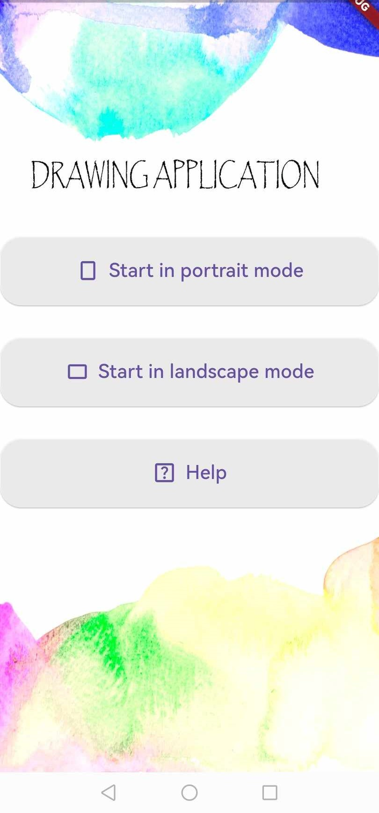
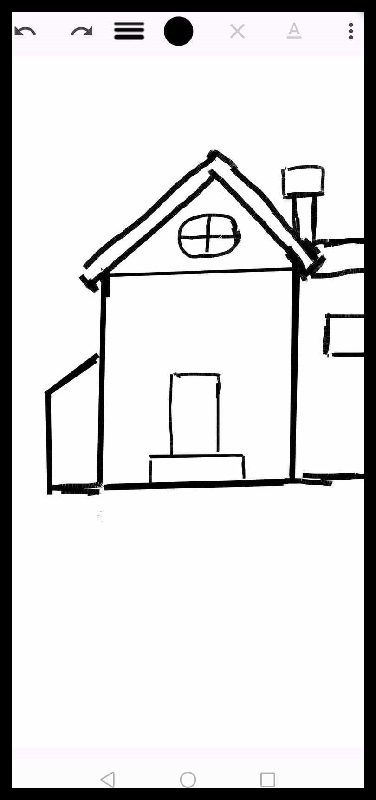
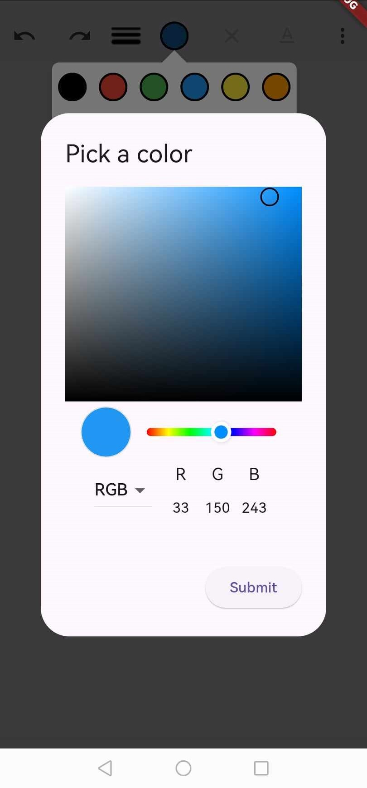
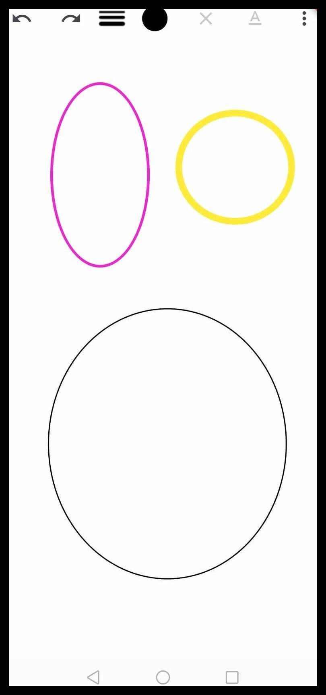
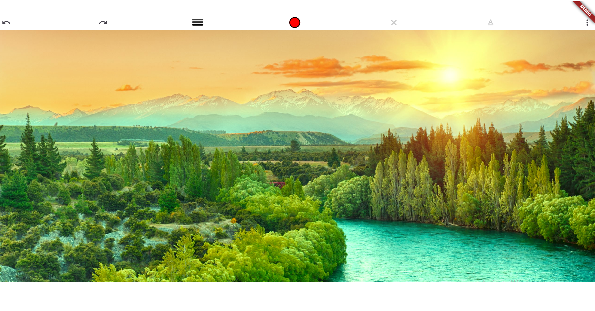
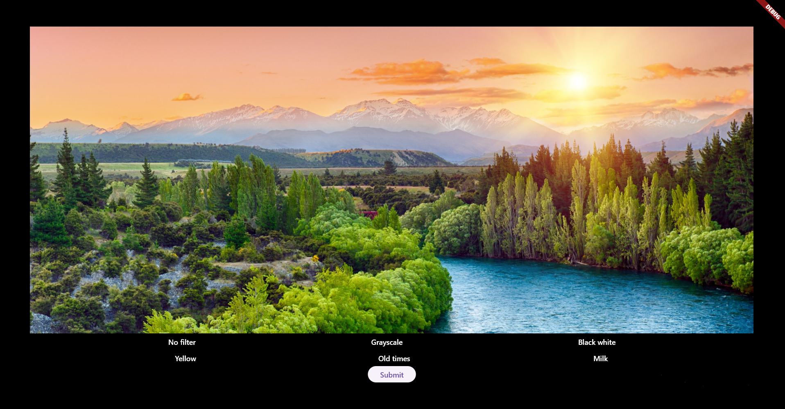

# Drawing App

A cross-platform mobile drawing application built with **Flutter**. Create, draw, and design with ease on iOS and Android devices.

## Features

- ✏️ **Line Drawing** - Draw smooth, customizable lines
- 📐 **Shapes** - Draw rectangles and other geometric shapes
- 🎨 **Color Picker** - Choose from a wide range of colors
- 📏 **Thickness Control** - Adjust brush stroke thickness
- 🖼️ **Image Support** - Load images and draw on top of them
- 💾 **Export** - Save your drawings as PNG files
- 🎯 **Clean UI** - Intuitive and user-friendly interface

## How to Use

1. **Start Drawing** - Tap and drag to draw lines on the canvas
2. **Create Shapes** - Use the shapes menu to add rectangles
3. **Customize** - Change brush color and thickness from the menu
4. **Load Image** - Import an existing image to draw on
5. **Export** - Save your finished artwork as PNG

## Screenshots

  
  
  
  
  
  

## Technology Stack

- **Framework**: Flutter
- **Language**: Dart
- **Platforms**: iOS, Android, Windows, Web

## Getting Started

1. Ensure you have Flutter installed ([flutter.dev](https://flutter.dev))
2. Clone the repository
3. Run `flutter pub get` to install dependencies
4. Run `flutter run` to start the app

---

**Enjoy creating!** 🎨
